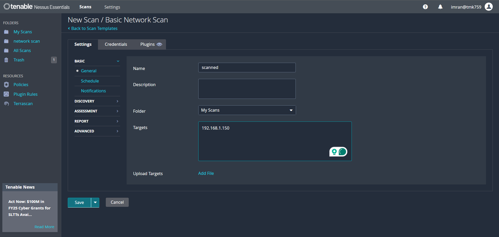
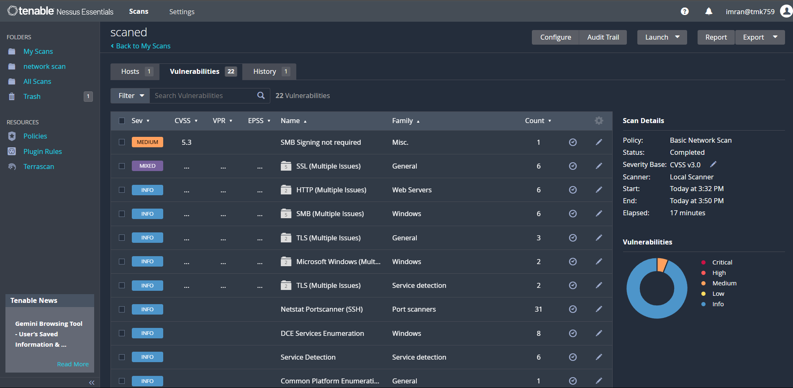

# CyberSecurity_Internship-Elevate_labs_task3

## Objectives

- Perform a comprehensive vulnerability scan on a local system
- Identify and analyze security vulnerabilities using industry-standard tools
- Document findings and provide actionable remediation strategies
- Demonstrate practical cybersecurity assessment skills

## Tools Used

- **Tenable Nessus Essentials**: Primary vulnerability scanner
- **Windows 10**: Target system for vulnerability assessment

## Methodology

### Steps Taken
1. Installed Nessus Essentials on assessment system
2. Configured scan target (192.168.37.130 - Kali Linux)
3. Verified network connectivity and service accessibility
4. Executed a comprehensive vulnerability scan using Nessus
5. Targeted localhost/local machine IP address
6. Generated a detailed vulnerability report

## Screenshots
# Configuring IP address for vulnerability scanning

# Result dashboard in Neesus Essential

### Critical Vulnerabilities Identified

## SSL Certificate Issues
- **Severity**: Medium to High
- **Location**: Port 8834 (Nessus Web Interface)
- **Issue**: Broken CA Chain detected
- **Impact**: Potential for man-in-the-middle attacks
